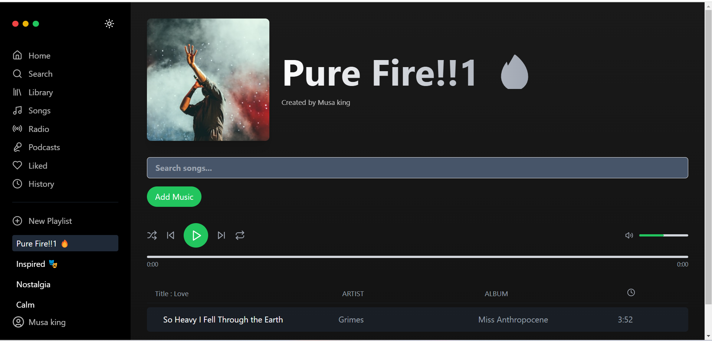

# Rhombix-Music-Player 🎵

A modern, stylish music player built with **React + Vite**.  
It supports playlist management, searching for songs, and a clean UI for smooth playback.

## Features 🚀
- 🎶 Add and manage playlists
- 🔍 Search songs easily
- 🎧 Play, pause, and control volume
- ⚡ Fast performance with Vite
- 💡 Built with Tailwind CSS for sleek design

## Screenshots 📸


## Installation & Setup 🚀

Follow these steps to set up and run the project on your local machine.

### **1. Clone the Repository**
```bash
git clone https://github.com/MUSA-apnacollege/Rhombix-Music-Player.git
cd Rhombix-Music-Player

### **2. Install Dependencies**
```bash
npm install
npm run dev
npm run build
npm run preview
